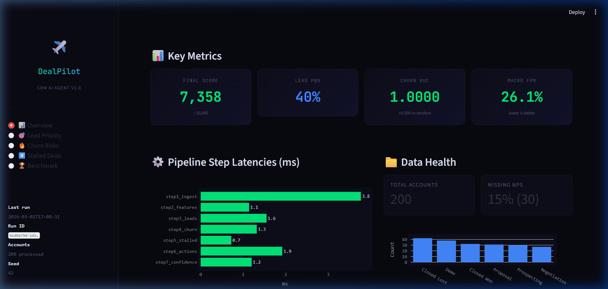
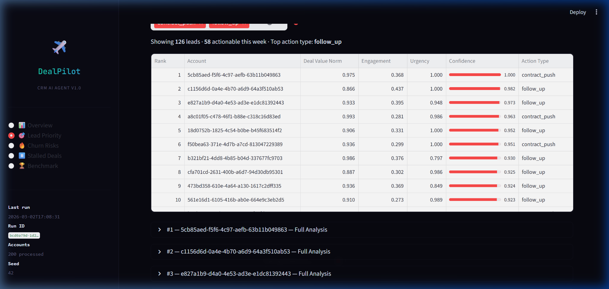
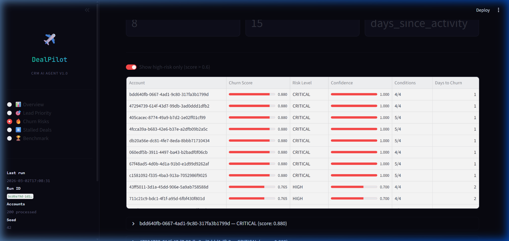
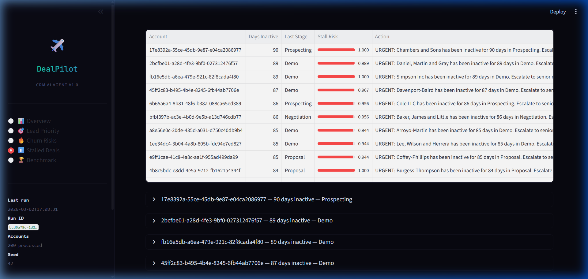
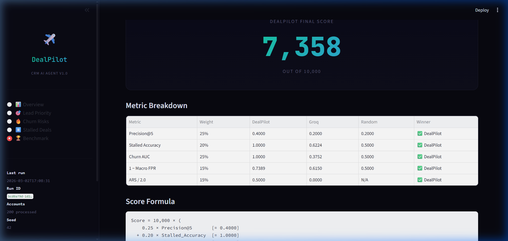

# ✈ DealPilot — CRM AI Optimization Agent

An 8-step deterministic pipeline that ranks leads, predicts customer churn, and detects stalled deals from raw CRM data. Steps 1–5 are fully deterministic with zero LLM calls. Step 6 uses a single Groq API call (Llama 4 Scout) per alert for action generation. Steps 7–8 apply cross-signal confidence adjustments and produce validated JSON output.

---

## Problem Statement

Every CRM system collects the same structured signals — deal values, activity timestamps, support ticket counts, NPS scores, contract renewal timelines — across hundreds of accounts. What no CRM actually produces is a single, prioritized answer to the question every sales rep asks at 9 AM: *which accounts need my attention today, and what should I do about them?*

Without that answer, reps spend 5–8 hours a week manually scanning dashboards, applying gut heuristics to decide which lead to call next, which deal might be slipping, and which customer is quietly heading for the exit. The result is predictable: high-value leads with urgent timelines get the same attention as stagnant ones, and churn signals are caught weeks too late — after the renewal window has already closed.

We considered building a standalone churn predictor or a lead-scoring microservice. Both were rejected because they solve fragments in isolation. A churn model that flags risk without recommending a specific action just creates alert fatigue. A lead scorer that ignores churn cross-signals will rank a high-value account at the top even when that account is about to leave. The real value sits in the joint inference — ranking, churn, and stall detection feeding into one prioritized, actionable output.

This is the highest-leverage problem because it sits directly at the conversion bottleneck. Improving lead prioritization by even one correct call per week compounds into pipeline velocity gains that no amount of downstream tooling — better email templates, faster CRM load times, prettier dashboards — can replicate. Get prioritization right, and every other sales optimization becomes more effective. Get it wrong, and none of them matter.

---

## Architecture

```
CRM CSV → [Step 1: Ingest] → [Step 2: Features] → [Step 3: Lead Ranking]
       → [Step 4: Churn] → [Step 5: Stalled] → [Step 6: LLM Actions]
       → [Step 7: Confidence] → [Step 8: Output] → predictions.json
```

| Step | File | Description | LLM? |
|------|------|-------------|------|
| 1 | `pipeline/step1_ingest.py` | Load and validate CSV data | No |
| 2 | `pipeline/step2_features.py` | Compute engagement, urgency, support signals | No |
| 3 | `pipeline/step3_leads.py` | Weighted composite scoring and ranking | No |
| 4 | `pipeline/step4_churn.py` | Multi-factor churn risk scoring | No |
| 5 | `pipeline/step5_stalled.py` | Inactivity-based stall detection | No |
| 6 | `pipeline/step6_actions.py` | Groq-powered action recommendations (Llama 3) | **Yes** |
| 7 | `pipeline/step7_confidence.py` | Cross-signal confidence adjustments | No |
| 8 | `pipeline/step8_output.py` | Pydantic validation + JSON serialization | No |


All thresholds and weights are centralized in `config.py`. No magic numbers in pipeline files.

---

## Screenshots

### Overview — Key Metrics & Pipeline Latencies


### Lead Priority — Ranked Leads with Confidence Scores


### Churn Risks — Multi-Factor Risk Analysis


### Stalled Deals — Inactivity Alerts


### Benchmark — DealPilot vs Groq vs Random Baseline


---

## Requirements

**Python 3.10+**

### Core dependencies
```
pip install -r requirements.txt
```
| Package | Purpose |
|---------|---------|
| `pydantic>=2.0` | Schema validation for all pipeline data |
| `groq` | Groq API for Step 6 action generation (Llama 4 Scout) |
| `numpy>=1.24.0` | Numerical operations in feature engineering |
| `python-dotenv>=1.0.0` | Environment variable management |
| `scikit-learn>=1.3.0` | Evaluation metrics (AUC, precision) |
| `faker>=20.0.0` | Synthetic dataset generation |

### Dashboard dependencies (optional)
```
pip install -r requirements_ui.txt
```
| Package | Purpose |
|---------|---------|
| `streamlit>=1.32.0` | Interactive dashboard UI |
| `pandas>=2.0.0` | Data manipulation for tables |
| `plotly>=5.18.0` | Charts and visualizations |

---

## Quick Start

### 1. Set up environment
```bash
cd dealpilot
pip install -r requirements.txt
cp .env.example .env
# Add your GROQ_API_KEY to .env (optional — pipeline works without it)
```

### 2. Generate benchmark data
```bash
python benchmarks/generate_dataset.py
```
Produces `benchmarks/synthetic_crm_dataset.csv` (200 records) and `benchmarks/ground_truth_labels.json`.

### 3. Run the pipeline
```bash
# With LLM actions (requires GROQ_API_KEY)
python main.py --input benchmarks/synthetic_crm_dataset.csv

# Without LLM (uses rule-based fallback actions)
python main.py --input benchmarks/synthetic_crm_dataset.csv --no-llm
```
Output is written to `outputs/predictions_<timestamp>.json`.

### 4. Run evaluation
```bash
python benchmarks/evaluation_script.py outputs/latest_predictions.json \
  --ground-truth benchmarks/ground_truth_labels.json
```

### 5. Launch dashboard (optional)
```bash
pip install -r requirements_ui.txt
python -m streamlit run app.py
```

---

## Evaluation

Predictions are scored against ground truth using five metrics:

| Metric | Weight | Description |
|--------|--------|-------------|
| Lead Precision@5 | 25% | Are the top 5 ranked leads actually high-priority? |
| Stalled Accuracy | 20% | Does the detector correctly identify stalled deals? |
| Churn AUC | 25% | How well does the churn score separate churners from non-churners? |
| 1 − Macro FPR | 15% | Penalty for false positives across all tasks |
| ARS / 2.0 | 15% | Agent Reasoning Score — quality of LLM-generated actions |

**Final Score** = 10,000 × (0.25 × P@5 + 0.20 × Stalled_Acc + 0.25 × Churn_AUC + 0.15 × (1 − FPR) + 0.15 × ARS/2.0)

### Baseline comparison
```bash
python benchmarks/claude_baseline.py
```
Runs Groq (Llama 4 Scout) on the same dataset with the same ground truth and prints a side-by-side comparison table (DealPilot vs Groq vs Random baseline).

---

## Project Structure

```
dealpilot/
├── main.py                        # CLI entry point — runs full 8-step pipeline
├── config.py                      # All thresholds, weights, constants
├── models.py                      # Pydantic schemas (LeadRecommendation, ChurnPrediction, etc.)
├── app.py                         # Streamlit dashboard (5 pages)
├── pipeline/
│   ├── step1_ingest.py            # CSV loading and validation
│   ├── step2_features.py          # Feature engineering (engagement, urgency, etc.)
│   ├── step3_leads.py             # Weighted lead scoring and ranking
│   ├── step4_churn.py             # Multi-factor churn prediction
│   ├── step5_stalled.py           # Inactivity-based stall detection
│   ├── step6_actions.py           # LLM action generation (Groq Llama 3, temperature=0.7)
│   ├── step7_confidence.py        # Cross-signal confidence adjustments
│   └── step8_output.py            # Pydantic validation + JSON output
├── benchmarks/
│   ├── generate_dataset.py        # Synthetic CRM data generator (200 records)
│   ├── evaluation_script.py       # Metric computation and scoring
│   └── claude_baseline.py         # Groq (Llama 3) baseline benchmark
├── prompts/                       # LLM prompt templates
├── outputs/                       # Pipeline outputs (predictions, evals)
├── requirements.txt               # Core dependencies
├── requirements_ui.txt            # Dashboard dependencies
└── .env.example                   # Environment variable template
```

---

## Configuration

All numeric thresholds live in `config.py` as typed dataclasses. Key parameters:

- **Lead scoring weights**: deal_value (0.35), engagement (0.30), urgency (0.25), support_load (0.10)
- **Churn threshold**: accounts scoring above 0.6 are flagged high-risk
- **Stall detection**: deals inactive for 14+ days in non-closed stages
- **LLM**: Groq Llama 4 Scout at temperature=0.7, with structured output validation
- **Random seed**: 42 (set globally for reproducibility)

---

## License

MIT
